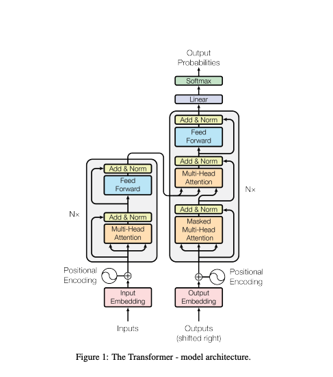

# GPT-DEV
 Reconstructs a character-level GPT/language model following the paper [”Attention is All You Need”](https://arxiv.org/pdf/1706.03762.pdf) and OpenAI’s GPT-2 / GPT-3.

 

 ## Notes
Bigram.py defines and trains a GPT with a context size of up to 256 characters, 384 feature channels, and it is a 6-layer Transformer with 6 heads in each layer. On one A100 GPU this training run takes about 3 minutes and the best validation loss is 1.4697.

However, I only have a Mac `:(`

So, since I'm running on CPU instead of GPU we must set both `--device=cpu` and also turn off PyTorch 2.0 compile with `--compile=False`. Then when we evaluate we get a bit more noisy but faster estimate (`--eval_iters=20`, down from 200), our context size is only 64 characters instead of 256, and the batch size only 12 examples per iteration, not 64. We'll also use a much smaller Transformer (4 layers, 4 heads, 128 embedding size), and decrease the number of iterations to 2000 (and correspondingly usually decay the learning rate to around max_iters with `--lr_decay_iters`). Because our network is so small we also ease down on regularization (`--dropout=0.0`). This still runs in about ~3 minutes, but gets us a loss of only 1.88 and therefore also worse samples, but it's still generates samples like this:

```
GLEORKEN VINGHARD III:
Whell's the couse, the came light gacks,
And the for mought you in Aut fries the not high shee
bot thou the sought bechive in that to doth groan you,
No relving thee post mose the wear
```

